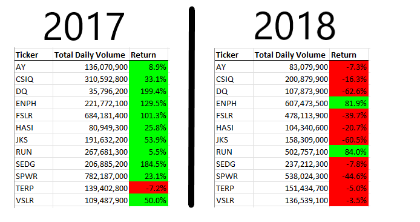
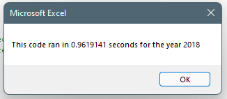
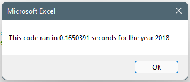

# Overview of Project

The analysis was centered around a VBA module that iterates through a dataset totaling stock market daily volumes per ticker. In addition, the script captures the starting and closing dollar amount of each stock in order to calculate the total return.

The goal of the analysis was to determine what stocks were doing well and what stocks were decreasing in value.  In order to differentiate between the performing stocks and declining stocks, the script signified tickers with positive returns with a green background while negative returns had a red background.

The goal of the project was to refactor the code for improved maintainability and increased performance.  We want to ensure the code performs well as more data and tickers are added to the dataset.

# Results

### Performance Comparison 
The stock performance between 2017 and 2018 was drastic.  Year 2017 ended with 11 of 12 stocks with positive returns, the highest almost reaching 200% return.  Year 2018 ended with 2 of 12 stocks with positive returns.



### Original Code vs Refactored
The refactored code out performed the original code.  The original script processed 36,144 rows compared to 3,012 rows in the refactored script.

```vbnet
'ORIGINAL

'Loop through tickers first
For i = 0 To 11
    
    Ticker = tickers(i)
    totalVolume = 0
    
    Worksheets(yearValue).Activate
    
    'Loop through dataset
    For j = 2 To RowCount
```

```vbnet
'REFACTORED

' Only process each row one time
For i = 2 To RowCount

    'get values for logic
    curRow = Cells(i, 1).Value
    nextRow = Cells(i + 1, 1).Value
    prevRow = Cells(i - 1, 1).Value
    volume = Cells(i, 8).Value
    price = Cells(i, 6).Value

    tickerVolumes(tickerIndex) = tickerVolumes(tickerIndex) + volume
    
    If curRow = tickers(tickerIndex) And curRow <> prevRow Then
    
        tickerStartingPrices(tickerIndex) = price
        
    End If
    
    If curRow <> nextRow Then

        tickerEndingPrices(tickerIndex) = price
        tickerIndex = tickerIndex + 1
        
    End If
    
Next i
```

The result was an 83% improvement in processing time.  The performance gains are highlighted in the below images that show the execution time before and after the refactor.

### Before


### After


> Note: processing time improvements were the same for 2017 & 2018 dataset

# Summary

## What are the advantages or disadvantages of refactoring code?
The clear advantages of refactoring code is performance, maintainability, readability, and improved quality. The additional time spent refactoring an existing codebase reduces the risk of furture bugs and extends the lifespan of the application.

*Example Advantages*

- Reduces the need for verbose comments / lines of code
- Decreases time needed for a new engineer to understand codebase
- Eliminate redundant code
- Increase reusability and reduce risk of logical bugs

One disadvantage of refactoring is the potential of overengineering an application or service.  Spending too much time refactoring code that is not exposed to change could result in wasted time and investment.

## How do these pros and cons apply to refactoring the original VBA script?

*Examples of Code Improvements*

- Change hard-coded values 

    ```
    For i = 0 to 11
    ```

    To functions to dynamically retrieve value

    ```
    For i = 0 to UBound(tickers)
    ```

- Change references to framework functions

    ```vbnet
    If Cells(j + 1, 1).Value <> Ticker And Cells(j, 1).Value = Ticker Then
        endingPrice = Cells(j, 6).Value
    ```

    To named variables

    ```vbnet
    If curRow <> nextRow Then
        tickerEndingPrices(tickerIndex) = price
    ```